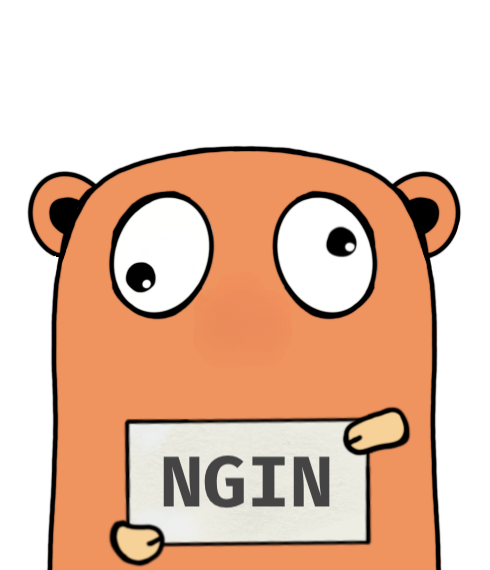

# Ononoki Engine

[](https://github.com/golang/go/releases/tag/go1.19.4)
[](https://pkg.go.dev/github.com/clavinjune/ononoki-engine)
[](https://goreportcard.com/report/github.com/clavinjune/ononoki-engine)
[](https://github.com/clavinjune/ononoki-engine/releases/latest)
[](https://github.com/clavinjune/ononoki-engine/blob/main/LICENSE)

[Ononoki](https://bakemonogatari.fandom.com/wiki/Yotsugi_Ononoki) Engine is an expert system rule engine to compile the given [rulebook](https://bakemonogatari.fandom.com/wiki/Unlimited_Rulebook) using forward chaining method.

See [example](./example/main.go)

## Usage

```shell
go get -u github.com/clavinjune/piper
```

## Roadmap

- [x] Make it run
- [ ] Add Reasoning
- [x] Better lint
- [ ] Tidy up code
- [ ] Add better docs
- [ ] Performance check