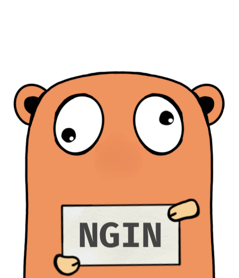

# Ononoki Engine

[Ononoki](https://bakemonogatari.fandom.com/wiki/Yotsugi_Ononoki) Engine is an expert system engine to compile the given [rulebook](https://bakemonogatari.fandom.com/wiki/Unlimited_Rulebook) using forward chaining method.

See [example](./example/main.go)